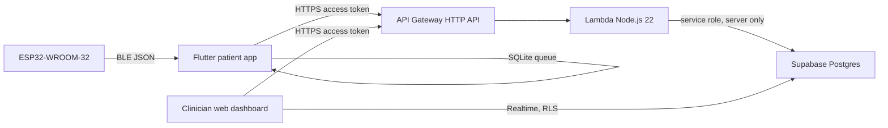

# Architecture

The prototype observes a simulated dressing without removing it. Localized temperature comes from a DS18B20. Ambient temperature and humidity come from a BME280. Relative moisture is a copper-tape ADC count, not a clinical exudate measurement. Green, yellow, and red LEDs plus a buzzer show predefined changes on the breadboard. The phone keeps a SQLite queue and retries upload. Nothing in this path diagnoses surgical-site infection.

Patients use only the Android app. Doctors, nurses, and admins use only the website. Public signup becomes a patient. Signup metadata cannot grant staff roles. Lambda checks the Supabase access token and then checks role and assignment again. The service-role key never leaves Lambda.

An enabled patient or device threshold replaces the global threshold for that target. Temperature alerts compare the new localized reading with the mean of earlier readings in the session. Moisture and humidity alerts compare the sample with the configured threshold. One open or acknowledged indicator is kept per patient and condition until it is resolved.
